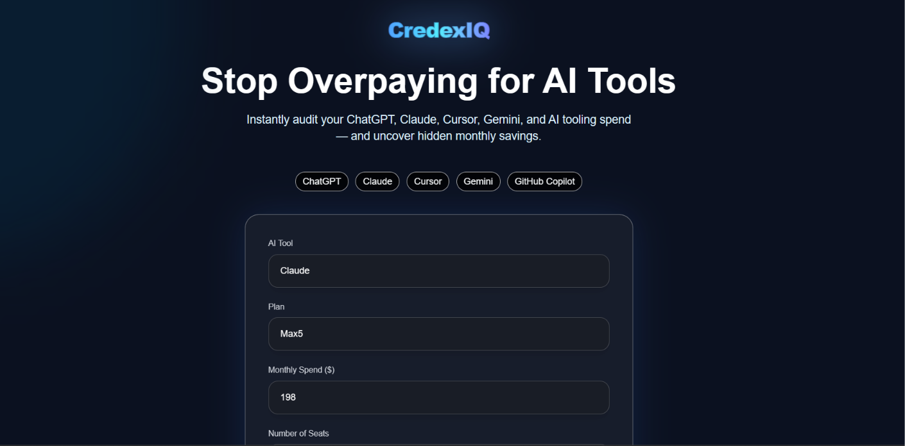
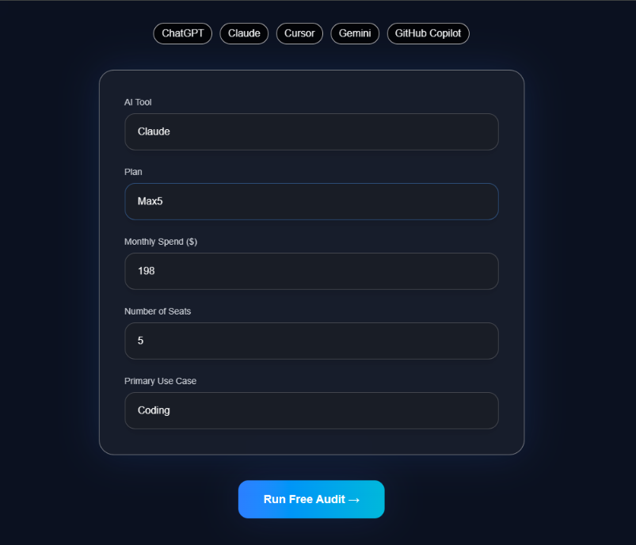
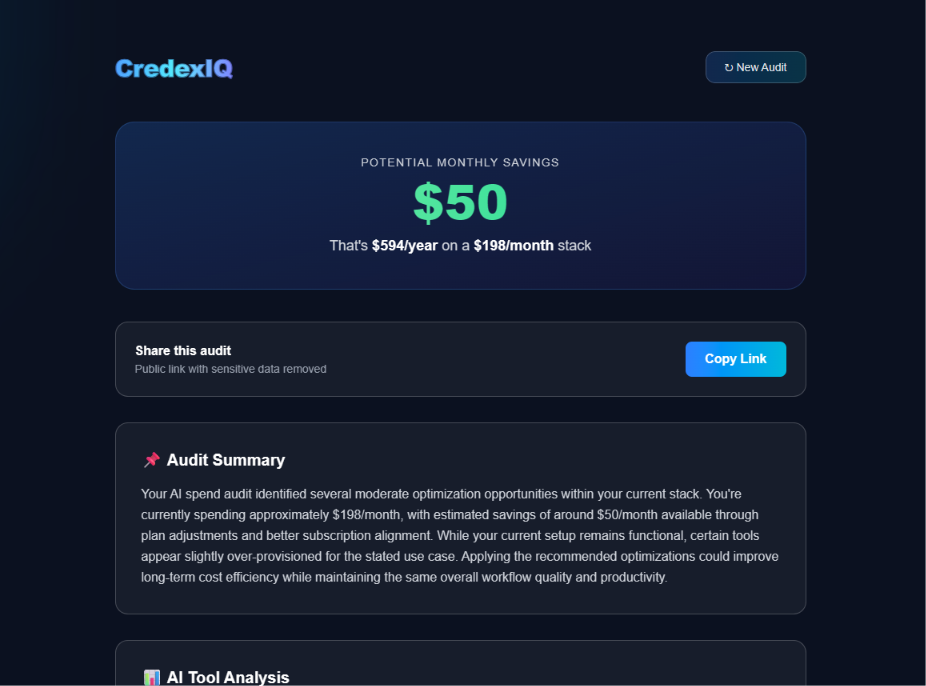
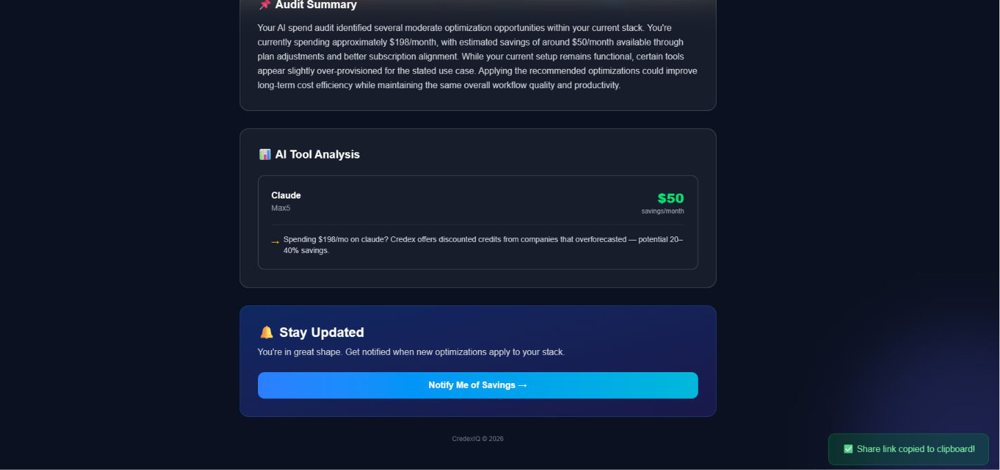
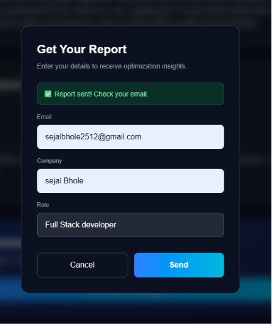
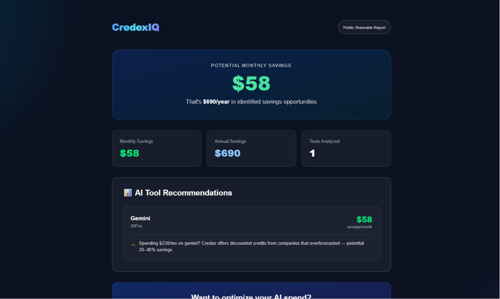

# CredexIQ

CredexIQ is a modern AI infrastructure cost optimization platform designed for startups, engineering teams, and AI-heavy workflows.

The platform audits AI subscription spending across tools like ChatGPT, Claude, Cursor, GitHub Copilot, Gemini, Windsurf, and more — identifying unnecessary costs, overlapping subscriptions, pricing inefficiencies, and optimization opportunities.

CredexIQ helps teams reduce recurring AI SaaS expenses through intelligent rule-based auditing, pricing analysis, and personalized optimization recommendations.

---

## Live Demo

Deployed on Vercel:

https://credex-audit-beta.vercel.app/

---

# Core Features

- AI subscription cost auditing
- Official pricing comparison engine
- Overpayment detection
- Wrong-plan detection
- Cross-tool redundancy analysis
- Monthly + annual savings calculations
- AI-generated optimization summaries
- Intelligent fallback summary system
- Shareable audit reports
- Local persistence using localStorage
- Responsive SaaS-style UI
- Automated CI pipeline with GitHub Actions
- Unit-tested audit engine using Vitest

---

# Supported AI Tools

CredexIQ currently supports auditing for:

- ChatGPT
- Claude
- Cursor
- GitHub Copilot
- Gemini
- Windsurf
- OpenAI API
- Anthropic API

Additional tools and pricing providers are planned in future updates.

---

# Current Audit Rules

The audit engine currently evaluates:

- Overpaying against official pricing
- Team plan mismatch detection
- Same-vendor downgrade opportunities
- Cross-tool redundancy
- Subscription overlap analysis
- AI credit optimization opportunities

---

# Tech Stack

| Layer | Technology |
|---|---|
| Frontend | Next.js 16 |
| Language | JavaScript |
| Styling | Tailwind CSS |
| Testing | Vitest |
| CI/CD | GitHub Actions |
| Deployment | Vercel |
| AI Integration | Google Gemini API |
| State Persistence | localStorage |
| Database | Supabase |

---

# Local Development

## Clone Repository

```bash
git clone https://github.com/SejalBhole-sudo/credexiq
```

---

## Install Dependencies

```bash
npm install
```

---

## Start Development Server

```bash
npm run dev
```

---

## Run Tests

```bash
npm run test
```

---


# Architecture Decisions

## Why Next.js?

Next.js App Router provides:

- scalable routing architecture
- built-in API routes
- optimized frontend performance
- seamless Vercel deployment
- simplified full-stack development

---

## Why Rule-Based Auditing Instead of AI Calculations?

Financial recommendations should be:

- deterministic
- explainable
- auditable
- reproducible

CredexIQ intentionally uses rule-based pricing analysis instead of AI-generated financial calculations.

AI is only used for:

- personalized summaries
- recommendation explanations
- optimization narratives

---

## Why JavaScript Instead of TypeScript?

The project prioritized rapid iteration and fast MVP execution during a constrained startup-style build cycle.

Risk reduction is handled through:

- deterministic audit logic
- modular architecture
- isolated business rules
- automated testing

---

## AI Summary Architecture

The original implementation plan included Anthropic Claude for AI-generated audit summaries.

During development, Gemini Flash APIs were used instead due to:
- faster prototyping iteration
- easier free-tier access during MVP development
- simpler integration workflow for rapid experimentation

The summary system was intentionally designed with graceful fallback behavior so audit results remain fully functional even if AI generation fails or rate limits occur.

Importantly, AI is only used for:
- executive-style summaries
- explanation formatting
- recommendation presentation

All pricing calculations, savings analysis, and audit recommendations remain deterministic and rule-based to ensure explainability and consistency.

---

# Current Project Status

## Completed

- Core audit engine
- Savings calculation system
- Responsive homepage
- Results dashboard
- AI summary integration
- Fallback summary engine
- Shareable report infrastructure
- Testing infrastructure
- CI workflow
- Deployment pipeline
- Product documentation
- UI/UX polish
- Supabase persistence
- Lead capture workflows
- Email report delivery
- Public report sharing
- Team dashboards
- Pricing sync automation

---

# Future Improvements

- Team collaboration dashboards
- Real-time pricing synchronization
- Advanced analytics visualizations
- Referral system
- Multi-audit history
- Enterprise reporting
- SaaS spend forecasting

---

# Repository Structure

credexiq/
├── src/
│   ├── app/
│   │   ├── api/
│   │   │   └── summary/
│   │   ├── report/
│   │   │   └── [id]/
│   │   ├── results/
│   │   ├── favicon.ico
│   │   ├── globals.css
│   │   ├── layout.js
│   │   └── page.js
│   ├── components/
│   ├── lib/
│   └── __tests__/
│
├── public/
│
├── .env.local
├── .gitignore
├── ARCHITECTURE.md
├── DEVLOG.md
├── ECONOMICS.md
├── eslint.config.mjs
├── GTM.md
├── jsconfig.json
├── LANDING_COPY.md
├── METRICS.md
├── next.config.mjs
├── package-lock.json
├── package.json
├── postcss.config.mjs
├── PRICING_DATA.md
├── PROMPTS.md
├── README.md
├── REFLECTION.md
├── TESTS.md
└── USER_INTERVIEWS.md

---

## Screenshots

### Landing Page


### AI Audit Form


### Audit Result — Savings Overview


### Audit Result — Recommendations Breakdown


### Email Details Form


### Shareable Public Report



---

# Author

Built by Sejal Bhole as part of a startup-focused engineering assignment focused on AI infrastructure optimization and SaaS cost analysis.